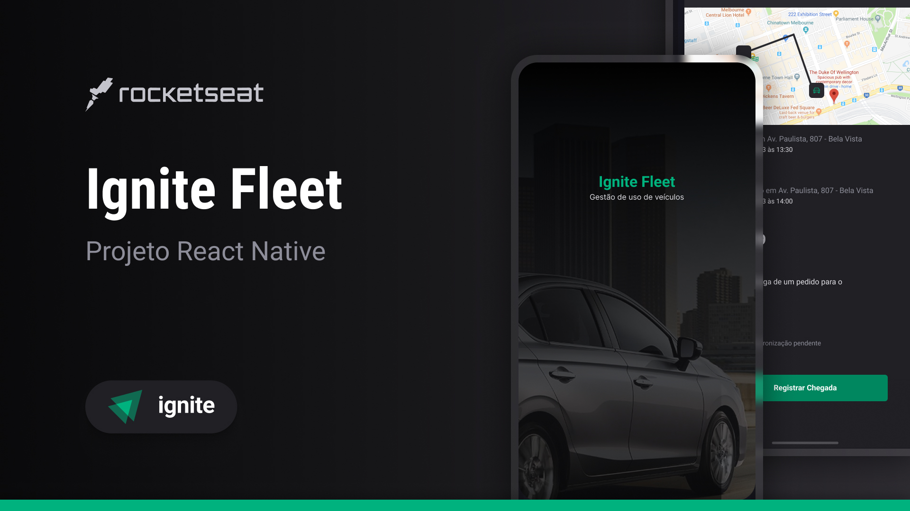

# IGNITE FLEET

Template para prosseguir com o curso de React Native: Projeto 06
<!-- 
## 



## Sobre o projeto

Deliveroo é um projeto React Native Expo que simula um aplicativo de compras. É um projeto em que utiliza varias tecnologias diferentes para que o usuário tenha uma boa experiência na utilização.

O app simula um sistema de filtragem de produtos além de integração com oa API do Google Maps para geolocalização. -->
<!-- 
<div align="center">
    
    
    
    
    
    
    
    
</div> -->

## 🛠 Tecnologias

As seguintes ferramentas foram usadas na construção do projeto:

- [Expo](https://expo.io/)
- [React Native](https://reactnative.dev/)
- [TypeScript](https://www.typescriptlang.org/)
- [React Navigation](https://docs.expo.dev/routing/introduction/)
- [Zustand](https://zustand-demo.pmnd.rs/)

## Pré-requisitos

Antes de começar, você vai precisar ter instalado em sua máquina as seguintes ferramentas:
[Git](https://git-scm.com), [Node.js e npm](https://nodejs.org/en/).

Além disto é bom ter um editor para trabalhar com o código como [VSCode](https://code.visualstudio.com/), e um emulador ou aparelho com o Expo Go instalado.

O projeto utiliza integração com o autenticação com a API do google através do Google console, será necessário ter um projeto no google console e criar 3 chaves OAuth2, sendo: Web Browser, Android com chave SHA-5, e uma chave para IOS, para que funcione a integração com o IOS é necessário baixar ter o arquivo Google-Services.plist na raiz do projeto. Adicione as suas KEYS geradas no console da google e adiciona-la ao `.env`.

### Executando o aplicativo

```bash
# Clone este repositório
$ git clone https://github.com/gustavosorati/ignite-fleet

# Vá para a pasta server
$ npm install

# Faça o prebuild do projeto
$ npx expo prebuild

# Instale o projeto no seu emulador
$ npm run android
```